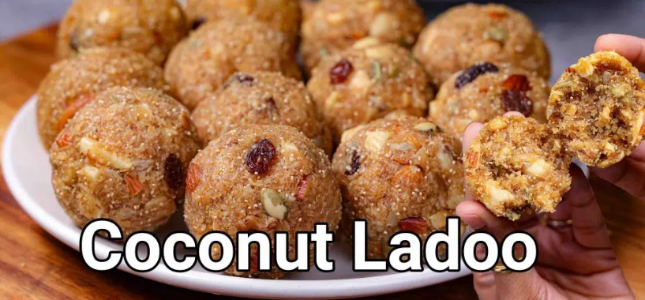

# COCONUT LADOO RECIPE

### DESCRIPTION: A traditional Indian **sweet ball** made primarily from coconut and sweetener like sugar, jaggery or condensed milk. *Prepared generally during festivals.*

### Main Ingredients

- Coconut
- Sugar
- Cardamom
- Condensed milk

https://hebbarskitchen.com/coconut-ladoo-recipe-nariyal-ladoo/

